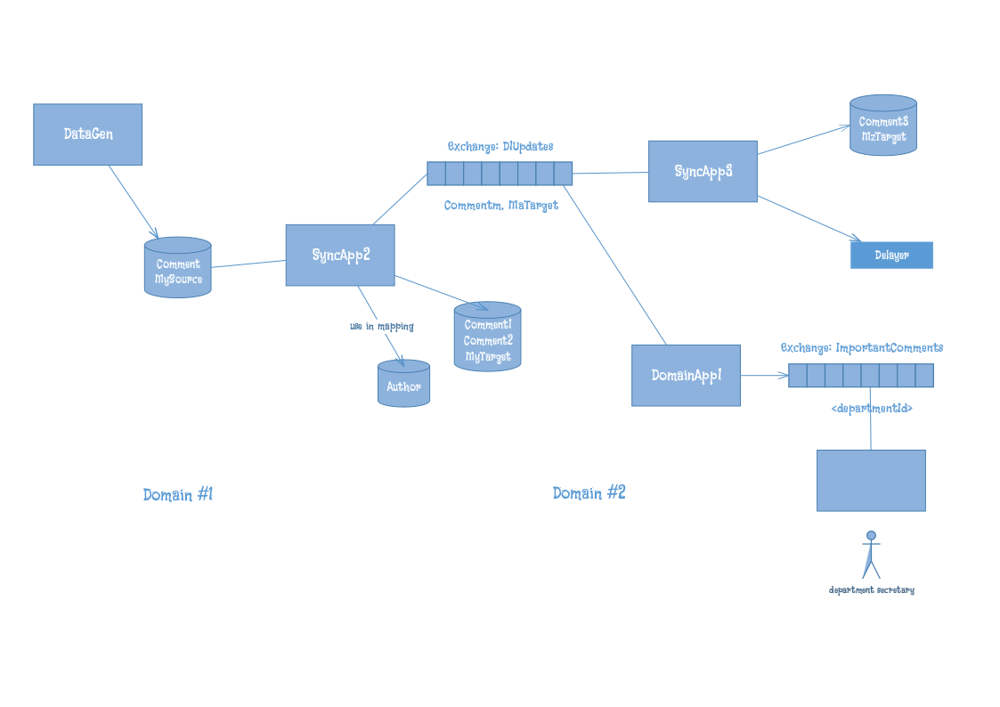

# Dafist
Data flow, integration and synchronization tool

This is a lightweight, robust and general-purpose tool that can be used to automate the flow of data between different systems or to perform data synchronization. It uses a microkernel architecture which allows different plugins (called connectors) to be developed for different technologies like SQL server and RabbitMQ. 

## Main features:
* Support simple or custom transformations (data mappings)
* Guaranteed delivery & robustness by recognizing different types of problems
* Support connecting to anything; not just relational or NoSQL databases or message brokers.
* Support data routing graphs by creating different Dafist nodes

## Sample applications diagram:
    
